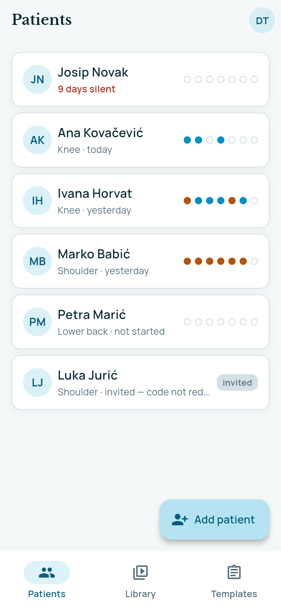
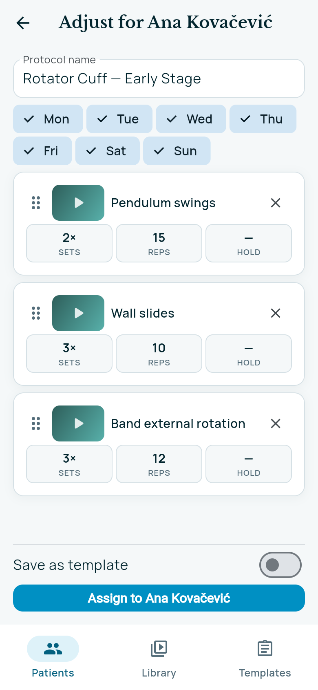
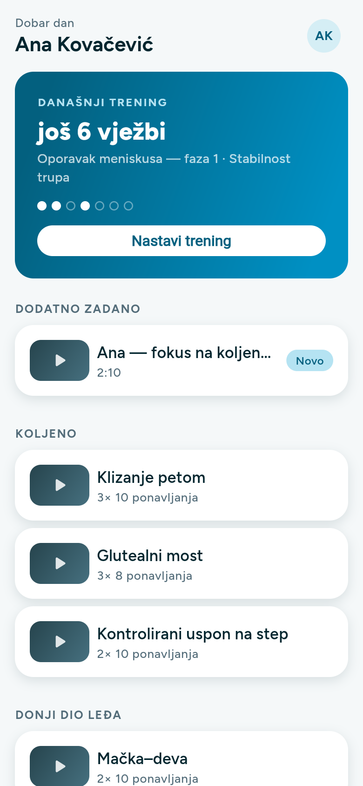
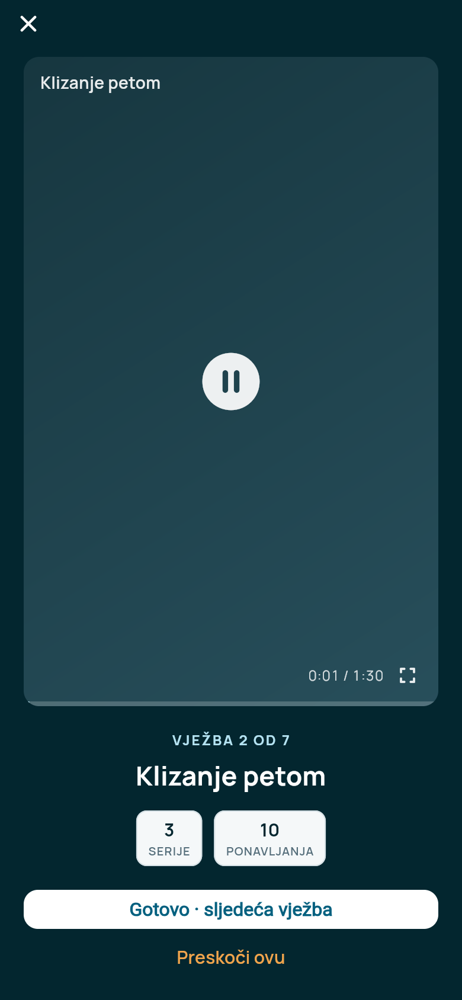

# Physio App

A Flutter app where a physiotherapist assigns personalised rehab exercise videos to patients, and each patient follows a guided daily session and reports completion. Built as a working showcase for a physiotherapy practice.

The problem it addresses: exercise videos usually live in WhatsApp threads, YouTube links and printed sheets, and the physio has no way of knowing whether the patient did the work between appointments.

<p>
  
  
  
  
</p>

## Features

**Physio**
- Patient list and patient detail with adherence over the week
- Exercise library and reusable templates (e.g. a knee recovery phase)
- Assign exercises with dosage (sets, reps, hold time), from a template or one by one
- Upload exercise videos, compressed on the device on iOS and Android

**Patient**
- Today's session built from all active assignments, resumable mid-session
- Guided video player per exercise, completion reporting
- Week strip showing what was done

**Both**
- Croatian and English UI
- Layouts checked at 320×568, 375×667 and 430×932

## Tech

| Area | Choice |
|---|---|
| App | Flutter, Dart, `flutter_bloc`, `go_router`, feature-first structure |
| Backend | Firebase Auth, Cloud Firestore, Cloud Storage |
| Security | Firestore and Storage rules scoped per clinic (`clinics/{clinicId}`), invite redemption enforced in rules |
| Tests | 137 Dart unit, bloc and widget tests (incl. an overflow sweep across screen sizes), 49 security-rules tests on the Firebase emulator, Playwright end-to-end tests |

The data model is multi-tenant from the start (every document carries a `clinicId`); the app ships with one clinic.

## Project layout

```
app/        Flutter app (lib/features: patients, library, templates, assignments, home, session, role_gate)
firebase/   Firestore + Storage rules, rules tests (Vitest), emulator seed and admin scripts
e2e/        Playwright end-to-end tests and screenshots
docs/       Design spec and implementation plans
vault/      Working notes: design system, known complications
```

## Running it

Demo mode, in-memory data that resets on restart:

```bash
cd app
flutter run -d chrome        # or -d macos
```

Against the Firebase emulator:

```bash
cd firebase && npm install && npm run emulators   # terminal 1
npm run seed                                      # terminal 2: demo clinic, physio, patients
cd ../app && flutter run -t lib/main_firebase.dart -d chrome
```

`main_firebase.dart` uses the emulator by default (`USE_EMULATOR=true`).

## Testing

```bash
cd app && flutter analyze && flutter test   # Dart tests
cd firebase && npm test                     # security rules on the emulator
```

## Status

Showcase / MVP. The scope and the open design decisions are in `docs/superpowers/specs/` and `vault/Complications.md`.
